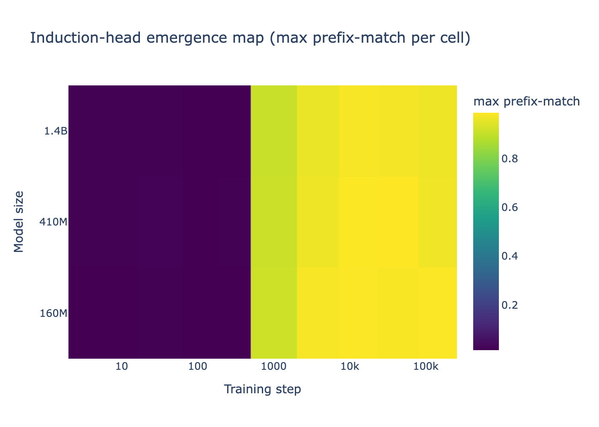
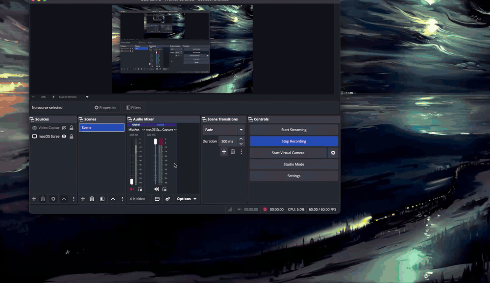
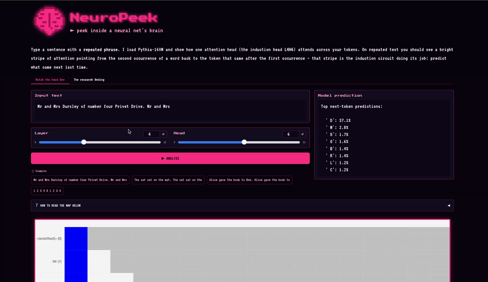
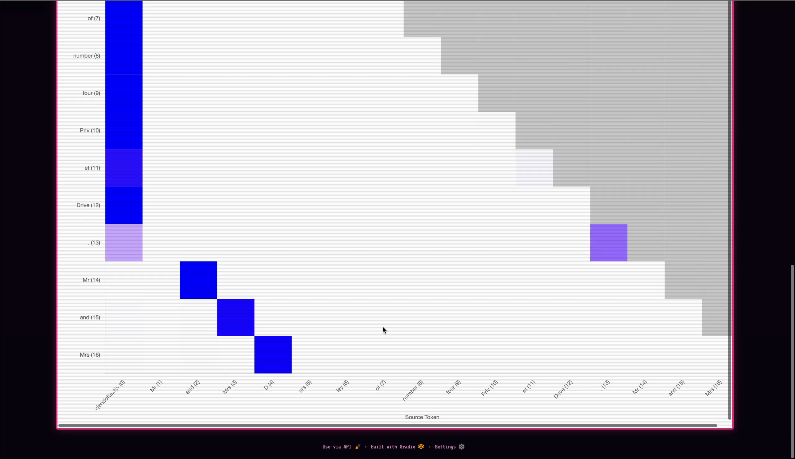

# NeuroPeek

Mechanistic interpretability on small language models, reproducing
induction heads (Olsson et al., 2022) on Pythia, then mapping their
emergence across the **(model scale × training step)** grid using Pythia's
public training checkpoints.

> **Status:** ✅ complete. Headline: induction-head emergence is
> **scale-invariant in training-step terms**, all three Pythia sizes
> (160M / 410M / 1.4B) cross the `max prefix-match ≥ 0.3` threshold at
> training step 1000.
> Writeup: [`docs/writeup.md`](docs/writeup.md).



*All three model sizes flip from no-induction (dark) to mature-induction (yellow) inside the same training-step window, between step 256 and step 1000.*

---

## What this project is

**Reproduction.** Identify induction heads on Pythia-160M / 410M / 1.4B using
TransformerLens. On Pythia-160M, the canonical induction head **L4H6** has
prefix-match score **0.985** (top-10 in `results/pythia_160m_heads.json`).
The in-context-learning loss-by-position curve on Pythia-410M shows the
characteristic drop between positions ~5 and ~50, Olsson '22 figure 1
qualitatively reproduced.

**Extension.** Pythia is the only major model family that ships training
checkpoints across its full training run. NeuroPeek sweeps a 3-size ×
12-checkpoint emergence grid (36 cells), with per-cell prefix-match scoring
plus cache-cleanup-between-cells (peak disk ~6 GB instead of ~70 GB).
A power law fit to the emergence step vs model parameters gives exponent
**b ≈ 0** (machine-precision zero) with 95% bootstrap CI covering zero.
Induction-head emergence is locked to the *training schedule*, not the
*model's capacity*, across 8.7× in parameter count.

**Custom kernel.** A single Triton kernel fuses gather + mean-reduce along
the prefix-match diagonal in the attention pattern tensor, the hot inner
loop of induction-head identification. Targets 1.5-3× over PyTorch eager on
a Colab T4 (benchmark in `notebooks/03_kernel_benchmark.ipynb`).

**Writeup.** LessWrong-style post in [`docs/writeup.md`](docs/writeup.md) with
methodology in [`docs/METHODOLOGY.md`](docs/METHODOLOGY.md).

## Quickstart

```bash
uv sync --extra dev
make test                                   # full pytest suite (41 tests)
make lint                                   # ruff check
uv run python scripts/identify_pythia_160m.py    # P3, top induction heads on Pythia-160M
uv run python scripts/reproduce_olsson.py        # P4, ICL loss-by-position curve on Pythia-410M
uv run python scripts/run_emergence_grid.py      # P7, the headline 36-cell sweep (~3-4 hrs)
make reproduce                              # regenerate headline figures from results/
```

The Triton kernel benchmark requires CUDA. Open
`notebooks/03_kernel_benchmark.ipynb` in Colab (T4 runtime) and run all cells.

## Interactive demo



*`"...Mr and Mrs Dursley... Mr and Mrs"` → induction head **L4H6** attends from
each repeated token back to whatever followed it the first time, and the model
completes the pattern: top next-token **`' D'` at 37.1%** ("Dursley"). Drag the
**Head** slider off 6 and the stripe vanishes — proof it's that one specific head.*

```bash
make demo        # or: uv run --extra demo python app/demo.py
```

Launches a local Gradio app (default http://127.0.0.1:7860). Type a sentence
with a repeated phrase and watch the induction head L4H6 attend back to the
earlier occurrence, then see the model complete the pattern. A second tab
shows the emergence map. Loads Pythia-160M locally.
The attention figure is drawn by CircuitsVis from a CDN, so that panel needs
internet access (it renders inside an iframe so its script can run under Gradio).

<details>
<summary>More stills</summary>

**The "Watch the head fire" tab — prediction firing on the repeated phrase:**



**The induction stripe up close** — each repeated token (`Mr`/`and`/`Mrs`, rows
14–16) attends back to the token that followed its first occurrence
(`and`/`Mrs`/`D`): the circuit predicting the repeat.



</details>

## What's in here

| Path | What it is |
|---|---|
| `src/neuropeek/models.py` | TransformerLens loaders for Pythia 160M/410M/1.4B + GPT-2 small |
| `src/neuropeek/checkpoints.py` | Pythia checkpoint enumeration + emergence-step selector |
| `src/neuropeek/data.py` | Random-repeat sequences + Pile sample |
| `src/neuropeek/induction.py` | Prefix-matching score, copying score, head ranking |
| `src/neuropeek/icl.py` | In-context-learning loss-by-position |
| `src/neuropeek/patching.py` | Activation patching + head-ablation context manager |
| `src/neuropeek/faithfulness.py` | Circuit faithfulness / recovery metrics |
| `src/neuropeek/kernels/` | PyTorch reference + Triton kernel + backend selector |
| `src/neuropeek/emergence.py` | The (size × step) grid runner with cache-cleanup-between-cells |
| `src/neuropeek/scaling.py` | Power-law fit + bootstrap CIs |
| `src/neuropeek/viz/` | Plotly emergence heatmap + scaling-law figure + CircuitsVis attention |
| `src/neuropeek/tracking.py` | wandb wrapper with offline fallback |
| `scripts/` | Runnable drivers for each phase |
| `tests/` | 41 unit tests, CPU-only, runs in CI |
| `docs/writeup.md` | LessWrong-style writeup |
| `docs/METHODOLOGY.md` | Exact protocols, definitions, and reproducibility checklist |

## Why this exists

Part of a numbered portfolio series:
[Crypt](https://github.com/NeilP211/crypt),
[Exfil](https://github.com/NeilP211/exfil),
[FitGraph](https://github.com/NeilP211/fitgraph),
[DistKV](https://github.com/NeilP211/distkv).
This one (Project 2) sits at the intersection of mechanistic interpretability
research and low-level GPU programming, the niche where Anthropic-style
circuit-finding meets systems engineering.

## License

MIT. See [LICENSE](LICENSE).
